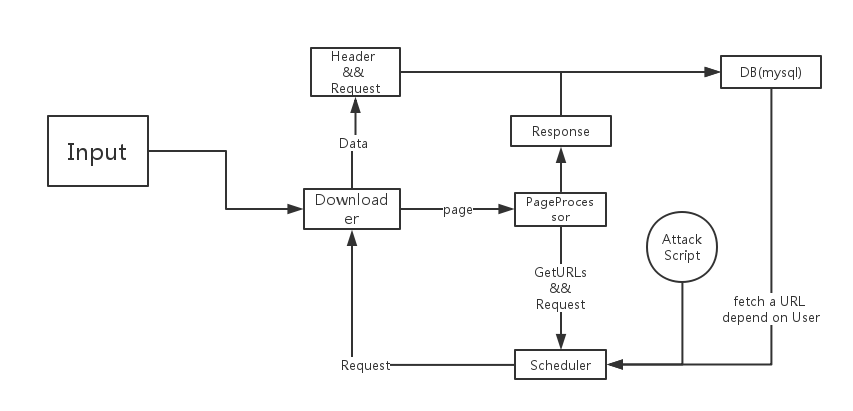
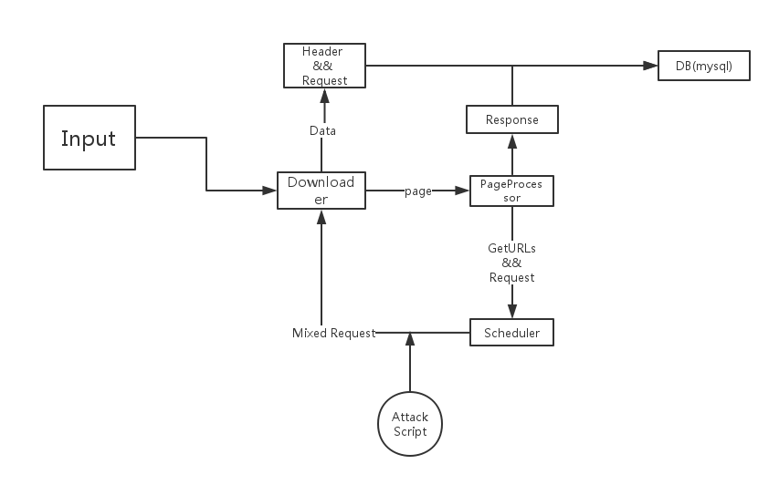

# tinny_seeker

## 爬虫框架说明
[go-spider](https://github.com/hu17889/go_spider/wiki/%E4%B8%AD%E6%96%87%E6%96%87%E6%A1%A3)

## feature:

* 爬虫(Spider)

  * 得到源站URL:站点爬虫URL数量`(-n int)`可定制，爬到的URL可以加入数据库中.做持久化存储,以便`Scheduler`后期继续获取。
  * 分析URL:`Downloader`负责分析源URL请求(`POST`,`GET`...)，入库,一个URL Record 对应一个`请求类型` 和 `原始带参`
  * 拿Response:通过`Page`模块在`Processor`中获取Response，入库。
* 扫描器(Scanner)

  * 对数据库中的URL进行扫描:对**特定的**页面装载`攻击脚本`后 请求这个URL ，把`Response` Update到这个URL的Record
  * 合并`Scanner`到Spider的`Downloader` 整合为一个`Seeker` 。重写`Downloader`逻辑,让`Downloader`变成一个可定制的`Scriptloader`

* 设计图:

  * v1:  
  * v2:  
